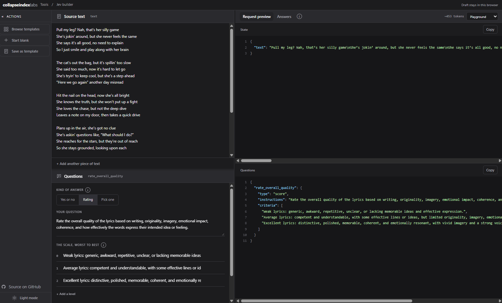
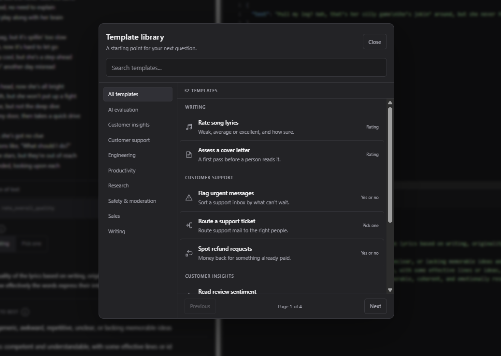
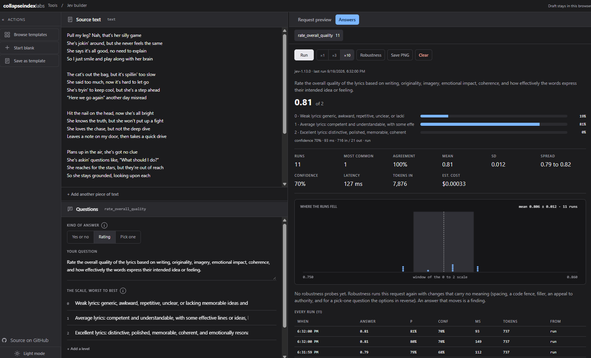

# jev-builder

**v1.19.0** · [Open the tool](https://collapseindex.github.io/jev-builder/) · Apache-2.0

Type or paste your text, say what you want [TypeSafe's Jev](https://typesafe.ai) to decide about it,
and get a request you can run. Then run it a few times and see whether the answer holds.



The text goes in as it is; the request is written as you type.

## Why it exists

Writing a Jev request by hand is annoying in two different ways.

The first is mechanical. The state is JSON, so every line break in a lyric, a transcript or an email
has to become `\n`, every quote has to be escaped, and the indentation has to survive being pasted
around. Doing that by hand, for a paragraph you only wanted to try, wastes a minute and is a good
way to introduce a typo you then debug for ten.

The second is that one answer tells you very little. Jev replies with a probability, so the question
worth asking is not "what did it say" but "does it say that every time, and does it still say it
when the text is padded with waffle or wrapped in a code fence". Answering that by hand means
running the same thing over and over and keeping notes.

This page does both. Paste the text as it is and the escaping is done for you. Fill in a question
and the request is written as you type. Press Run and every answer is kept, with how steady they
were.

It is not an eval platform and does not want to be: no datasets, no leaderboard, no account. For a
real harness, with labelled data, pre-registered thresholds and a findings ledger, use
[dinostomp](https://github.com/collapseindex/dinostomp), which this page can write a question file
for.

## What you get

- **Paste anything.** Line breaks, quotes, tabs, emoji, backslashes. The JSON is written for you and
  is valid by construction, because the browser's own `JSON.stringify` does it.
- **Three kinds of question**: yes or no (`noul`), a rating on a scale you describe (`score`), and a
  pick from your options (`choice`), with as many questions per request as you like.
- **34 templates** to start from, across support, moderation, writing, sales, research, engineering
  and AI evaluation. Six carry a second, constant field (a refund policy, routing rules, a job
  posting) so the question is judged against a rule instead of a hunch.
- **The request, four ways**: the full JSON body, the Playground's State and Questions panes, a
  Python snippet, or a curl command. Coloured, numbered, one click to copy.
- **Run it** once, three times or ten (see below), and keep every answer: the distribution, how
  often each answer came up, the mean, the standard deviation, the spread, confidence, latency,
  tokens, an estimated cost, and the raw response exactly as it arrived.
- **Robustness probes.** The same request again with changes that carry no meaning: spacing, a code
  fence, filler, manufactured confidence, an appeal to authority, politeness, and for a pick-one
  question the options reversed. Anything that moves the answer is worth knowing. The probes and
  their names match dinostomp's, so a finding here means the same thing there.
- **Save PNG** of the answer card, for a post or a ticket.
- **Save your own templates**, kept in your browser, listed under Your templates.
- **A dinostomp check file**, for when you do want to measure a question against examples you have
  labelled yourself.

Everything runs in your browser. No cookies, no analytics, no third-party requests, no build step,
no framework: one HTML file, one stylesheet, one module.

## Use it

Open <https://collapseindex.github.io/jev-builder/>. Nothing to install, and nothing you type leaves
the page.



Start from a template or start blank. Your own drafts can be saved here too.

## Running a request

Jev's API refuses cross-origin browser requests, so no web page can call it, whatever it does with
your key. Running therefore happens on your own machine:

```bash
git clone https://github.com/collapseindex/jev-builder.git
cd jev-builder
TYPESAFE_API_KEY=... npm start        # or put the key in a .env beside the repo
```

Open <http://localhost:4321> and press **Run**. `npm start` serves the page and forwards the request
to Jev with your key.

- The key is read from the environment, or a `.env` beside the repo, on the server side only. It is
  never sent to the page, never echoed back, never logged.
- The runner listens on 127.0.0.1 and answers only its own page.
- Never paste an API key into a web page, including this one. It does not ask for one.

On the hosted page there is no runner, so Run says so and offers **Paste a response** instead: run
the request wherever you like, paste back what Jev answered, and it is recorded the same way.



Eleven runs of the same request: what it answered, how far it moved, and what each one cost.

Runs are kept in your browser's local storage, up to 200, and can be cleared per question.

## How it is put together

| Path | What it is |
| --- | --- |
| `index.html` | The page: markup and the module that runs it. |
| `jev-builder-core.js` | Everything that turns a draft into a request: the template catalogue, the generators for each output shape, validation, highlighting, and the statistics. No DOM. |
| `styles.css` | The whole stylesheet, themed with custom properties. |
| `tests/test_jev_workspace.mjs` | Behaviour tests against a DOM stub, run with `node --test`. |
| `scripts/check-jev-builder.mjs` | Loads every template's check file with dinostomp's own loader. |
| `scripts/serve.mjs` | The page server and the Jev runner behind `npm start`. |

## Development

```bash
npm test                 # behaviour tests, no dependencies
npm run check:templates  # needs `pip install dinostomp` and python on PATH
```

The tests read `index.html`, pull out its module and run it against a small DOM stub, so they cover
what the page actually ships. `check:templates` writes each template's `.jev.yaml` and loads it with
dinostomp, which catches a template that looks fine but would not run.

## Security

The page collects nothing and never holds your key; the runner keeps it on your machine, listens on
loopback only, and answers just its own page. What is protected, what is not, and where to report a
problem: [SECURITY.md](SECURITY.md).

## Take it and do what you like

Apache-2.0, so fork it, rename it, ship it inside your company, put it behind your own domain. No
permission needed and no credit demanded beyond keeping the licence and the notice.

It is deliberately easy to hack on. There is no build step and no framework, so the app you edit is
the app that ships: open `index.html`, change it, reload. A few things people are likely to want:

- **Your own templates.** `TEMPLATES` in `jev-builder-core.js` is a plain array. Delete the ones you
  will never use, add your own policies, ship a copy where every question your team asks is already
  in the library.
- **Somewhere else to run.** `JEV_URL` in `scripts/serve.mjs` is one constant. Point it at a gateway,
  a proxy with your own quota, or a mock while you work offline.
- **Host it anywhere.** The whole site is static files, so any host that serves a folder will do:
  GitHub Pages, Cloudflare Pages, S3, nginx, a USB stick.
- **Keep it internal.** Nothing phones home, so a copy on a machine with no internet still writes
  requests; only Run needs the network.
- **Take the parts.** `jev-builder-core.js` touches no DOM: the generators, the validation, the
  tokenizer and the statistics all import cleanly into something else.

If you build something with it, an issue or a link is welcome, though not required.

## Contributing

Issues and pull requests are welcome. A new template needs a category, a short title, a blurb,
sample text, a question, and (for yes-or-no and pick-one questions) labelled examples. Run both
commands above before opening a pull request.

## Changelog

See [CHANGELOG.md](CHANGELOG.md).

## License

[Apache-2.0](LICENSE). Not affiliated with TypeSafe.
